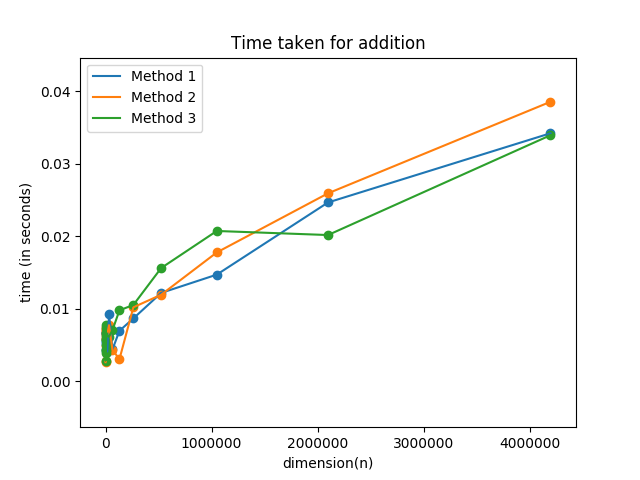

# Addition of `n` numbers using MPI

- ## Method 1
Process `A` splits `n` numbers into `n/p` parts and distributes the data among `p` processes. The processes add the numbers sequentially and return the sum to process `0` who adds the `p` sums to obtain the final sum.

- ## Method 2
Process `A` splits `n` numbers into `2` parts of size `n/2` each and distributes the data among `p_0` and `p_n/2` processes. This distribution occurs recursively and the data is distributed in a tree-like fashion. Each leaf process computes the sum sequentially and returns the sum to it's parent. The parent process receives the sum from it's two children, adds them and returns to it's parent till the final sum is obtained by the root. 

- ## Method 3
`MPI_Reduce` is used along with `MPI_SUM` operation to calculate the final sum.

The plot of `n` vs `time taken` for the three methods is as follows : 
