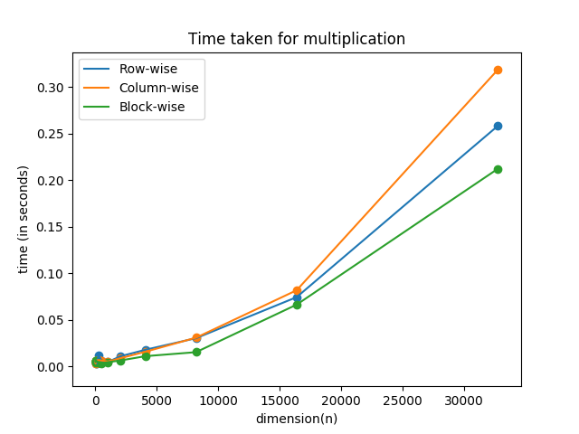

# Addition of `n` numbers using MPI

- ## Method 1 : Split row-wise
The matrix `A` having `m` rows and vector `x` having `n` elements are split into `p` segments such that each processor has `m/p` rows of `A` and `n/p` elements of `x`. Each processor distributes it's vector segment of `x` to other processes using `MPI_Scatter`. The vector `x` is constituted using `MPI_Allgather` and then matrix-vector multiplication is performed to form the vector `b`.

- ## Method 2 : Split column-wise
The matrix `A` having `m` rows and vector `x` having `n` elements are split into `p` segments such that each processor has `n/p` columns of `A` and `n/p` elements of `x`. Each processor performs matrix-vector multiplication to form a vector such that addition of all such vectors across the processes will form `b`. `MPI_Reduce` with `MPI_SUM` operation is used to achieve this step.

- ## Method 3 : Split block-wise
The matrix `A` having `m` rows and `n` columns is split into blocks of dimension `m/sqrt(p) X n/sqrt(p)`. Hence we have `p` blocks in total and each block is distributed to each process. As we have `sqrt(p)` rows of blocks, `MPI_COMM_WORLD` was split into `sqrt(p)` number of row communicators and after computation of each matrix block vector multiplication the vector is reduced along the row communicators to get the final sum.

The plot of `n` vs `time taken` for the three methods is as follows : 
