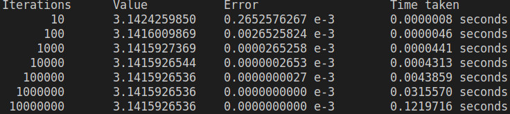
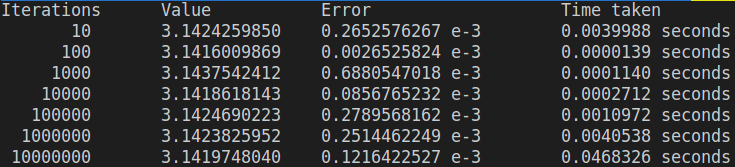
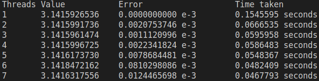

# Calculating the value of `PI` by integration using Trapezoidal method

The Trapezoidal method is used to calculate the value of `PI` and the method's accuracy and time taken is measured against number of iterations and number of threads used.

- ## Sequential Implementation

- ## Parallel Implementation

- ## Parameter - Number of Threads

- ## Speedup
### Iterations vs Speedup
| Iterations| Speedup|
|----------|--------|
| 10       | 0.0002 |
| 100      | 0.3309 |
| 1000     | 0.3868 |
| 10000    | 1.5903 |
| 100000   | 3.9973 |
| 1000000  | 7.7845 |
| 10000000 | 2.6044 |

### Threads vs Speedup
| Threads | Speedup            |
|---------|--------------------|
| 1       | 1                  |
| 2       | 2.318850472968411  |
| 3       | 2.593462962155051  |
| 4       | 2.635361979801631  |
| 5       | 2.8185412324228114 |
| 6       | 3.2039099602204764 |
| 7       | 3.3040148099693663 |
