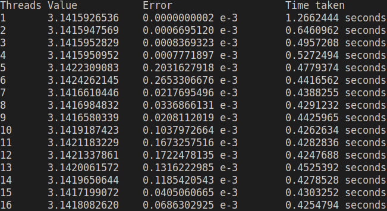

# Calculating the value of `PI` by integration using Trapezoidal method

The Trapezoidal method is used to calculate the value of `PI` and the method's accuracy and time taken is measured against number of iterations and number of threads used.

- ## Sequential Implementation

- ## Parallel Implementation

- ## Parameter - Number of Threads

- ## Speedup
### Iterations vs Speedup
| Iterations| Speedup|
|----------|--------|
| 10       | 0.0002 |
| 100      | 0.3309 |
| 1000     | 0.3868 |
| 10000    | 1.5903 |
| 100000   | 3.9973 |
| 1000000  | 7.7845 |
| 10000000 | 2.6044 |

### Threads vs Speedup
| Threads | Speedup            |
|---------|--------------------|
| 1       | 1                  |
| 2       | 2.318850472968411  |
| 3       | 2.593462962155051  |
| 4       | 2.635361979801631  |
| 5       | 2.8185412324228114 |
| 6       | 3.2039099602204764 |
| 7       | 3.3040148099693663 |

# Observations

It can be observed that on increasing the number of threads, the time taken decreases until `8` threads and it remains constant or a slight increase is observed. The machine the code was run on, has an `8` core processor and hence, the decrease was observed upto `8` threads. Beyond that, the maximum threads at one point of time was always `8` and due to context switches, a minor increase might be observed.

We can also observe that for less number of iterations, the time taken by sequential code is lesser than that of parallel implementation. The reason can be attributed to the fact that for less number of iterations, the thread-creation time becomes the dominating factor.

The precision of sequential code increases as we increase the number of iterations. But in parallel implementation, the precision increases upto `100 - 1000` iterations and beyond that, it decreases. The reason can be attributed to increased number of access of the shared memory containing floating point values.