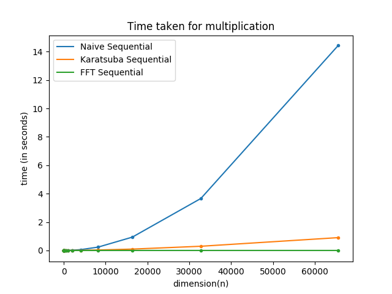
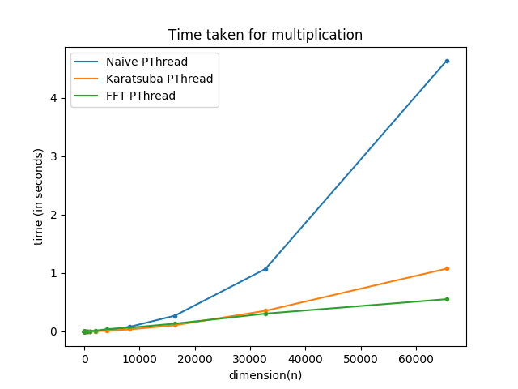
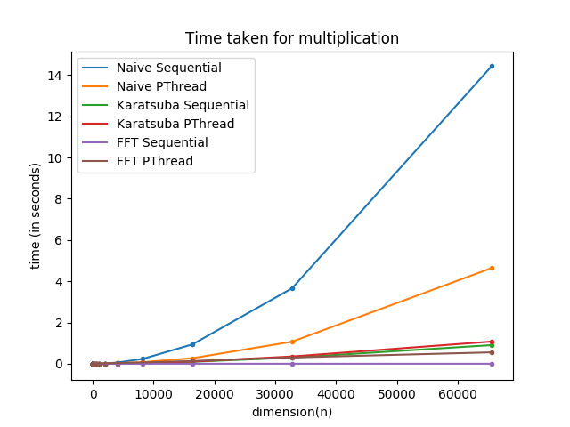

# Polynomial Multiplication using POSIX Threads

We perform multiplication of two polynomials using 2 methods :

- ## Naive method
We perform the `n*n` number of operations using `p` threads by splitting the coefficient array into `p` parts of length `n/p` who perform `n` operations each and later we add up the results to obtain the final answer.

- ## Karatsuba method
We perform the multiplication by creating 3 threads who perform 3 independent multiplications using a recursive subroutine and combine the results to obtain the final answer. This method is not scalable as the maximum number of threads required is `O(n)` and hence, on the machine tested, we cannot go beyond `n = 65536` threads.

- ## Recursive DFT
We obtain the **Discrete Fourier Transform** of the two polynomials by  evaluating them at `2n` points which are the `2n` *roots of unity*, where `n` is the degree of the polynomials. The conversion of the polynomials from *Coefficient form* to *Sample form* takes `O(nlog(n))` time. Now, multiplication of the samples, which implies pointwise multiplication of the sampls takes constant time for a point. We perform the polynomial multiplication in `O(n)` time. After the multiplication, we convert the sample form to coefficient form by **Inverse Fourier Transform** which again takes `O(nlog(n))` time. Hence, we achived the task in `O(nlog(n))` time complexity.

## Plots

Following are the comparative results for the 6 methods which are, *sequential* and *parallelised* versions of **Naive**, **Karatsuba** and **Fourier Transform** method.

