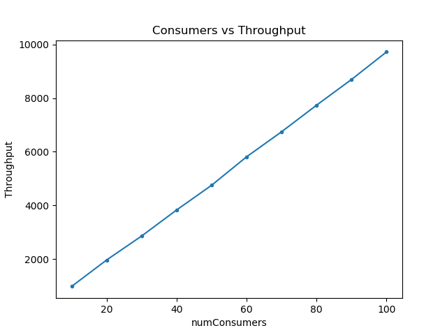
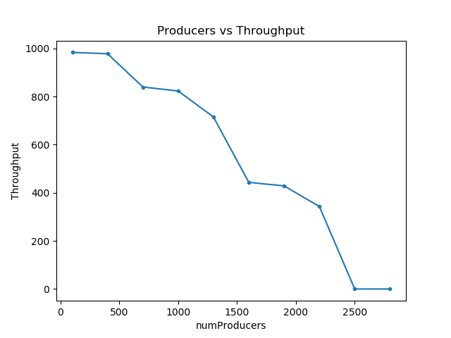
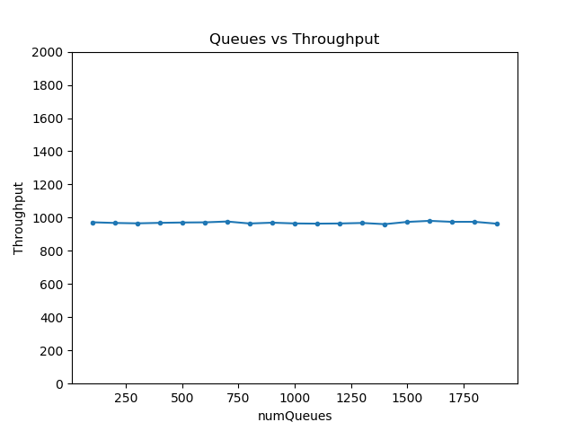
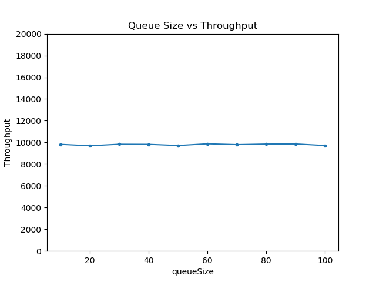

# Producer Consumer problem

We analyze the Producer Consumer problem by creating multiple producers and consumers, simulating them using a thread for each entity. Each producer produces a `Block` having a random number and pushes it into a `Queue` and sleeps for a specific time(*0.05 secs*). Each consumer pops(consumes) the `Block` from the Queue and sleeps for the time specified in the block.

The producers and consumers must acquire locks before entering their critical section to avoid race conditions. We use two sets of *mutexes* i.e. `producerLocks` and `consumerLocks`.

The *lock free queue* is simulated by using a stack of queues and each queue possess a `producerLock` and a `consumerLock` which must be acquired before pushing or popping a block respectively. Hence, at any point of time at least one producers and one consumer progresses.

We analyse the throughput of the system. Blocks simulate a *task* and each block in the queue contains a value `x` which simulates the number of *instructions* to be performed for that specific task. Hence, the consumers sleep for `x` seconds after popping the block. We take the sum of `x` which is equivalent to the number of total instructions performed and divide it by the time taken to obtain *throughput*.

## Plots
We study the variation of throughput against number of *producer* threads, *consumer* threads, *number* of queue segments and *size* of each queue segment.

Throughput increases linearly with increasing number of Consumers.

Throughput decreases with increasing number of Producers. As the number of producers increases, more threads will be waiting to acquire the lock and hence, throughput decreases rapidly.

Increase in number of queue segments has no effect on the throughput.

Increase in queue size has no effect on the throughput.
