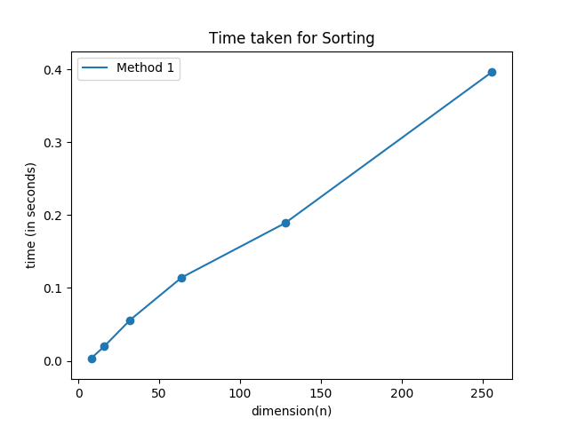

# Odd-Even method for Sorting n numbers using MPI

- ## Method
This method takes `n` iterations in total. In even number iteration, all numbers at even indices are compared with their adjacent number and swapped if necessary and in odd number iteration, same operation is performed on odd index numbers.

The plot of `n` vs `time taken` for the method is as follows : 
