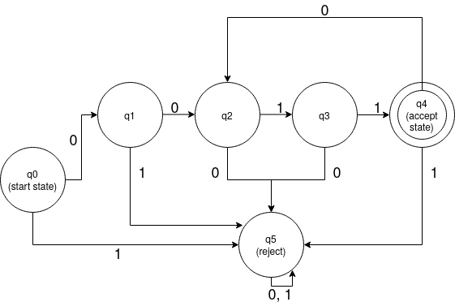

# Word acceptance by a Finite State Machine
Let *S* be an alphabet and *L* be a language defined over *S*. Suppose *M* is a minimal deterministic complete finite state machine that recognizes *L*. Write a parallel program (in `OpenMP` or `PThreads`) that takes input *M* and a word *w* and returns `true` if *M* accepts *w* otherwise `false`. The sequential complexity of this task is `|w|` = length of the word *w*.

For the above problem, we consider a Deterministic Finite Automaton *M* which accepts words of the pattern `(0011)*`. We implement the following DFA for the problem.

## Sequential approach
We use a transition matrix of dimensions `k x |S|` where `k` is the number of states and `S` is the set of alphabets. We iterate over the string sequentially and if the final state is present in the set of accepted states, we accept the word. The time complexity is `O(|w|)`.

## Parallel Approach
We split the string into `p` parts and send them to `p` processes. Each thread assumes a state `q` as it's initial state and processes the substring to arrive to a final state `qf`. This step takes `O(n/p)` time. 

As the processes do not know the actual starting state for the particular substring assigned to them, they iterate over all states assuming them inital and obtain `k` possible final states. This step takes `O(k)` time. 

After all processes have performed their tasks, we match the results to arrive at the actual final state. For the first segment `s0`, we know that initial state is `q0` and the corresponding final state obtained for `q0` by process `P0` will be the initial state for `P1`. We continue this iteration until we reach the final state obtained by `Pk-1` which is the final state for the entire string. This reduction step takes `O(p)` time.

Hence, the total time complexity is `O(k*n/p + p)`.

> References : [*Implementation of Deterministic Finite Automata on Parallel Computers : Jan Holub, Stanislav Stekr*](https://pdfs.semanticscholar.org/d8db/28d57b0a7f0faa5a5059dc276e4d9e75246f.pdf)
